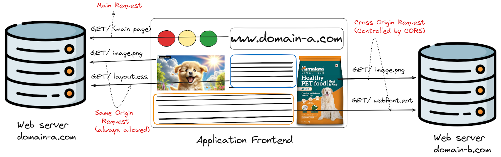

## Table Of Contents

- [What is Cross Origin Resource Sharing (CORS)?](#what-is-cross-origin-resource-sharing-cors)
- [Why is Cross Origin Resource Sharing Important?](#why-is-cross-origin-resource-sharing-important)
- [How Does Cross Origin Resource Sharing Work?](#how-does-cross-origin-resource-sharing-work)
- [How to Enable CORS?](#how-to-enable-cors)
- [Examples of Access Control Scenarios](#examples-of-access-control-scenarios)
- [Tools and Solutions for Cross Origin Resource Sharing](#tools-and-solutions-for-cross-origin-resource-sharing)
- [Security Best Practices for CORS](#security-best-practices-for-cors)
- [Conclusion](#conclusion)


## What is Cross Origin Resource Sharing (CORS)?



Cross Origin Resource Sharing (CORS) is a security mechanism implemented by web browsers that allows web applications to access resources from domains other than the one serving the application. It's a crucial component of modern web development, enabling developers to build more flexible and powerful applications while maintaining security.

To understand CORS better, we first need to grasp the concept of the Same-Origin Policy. This policy is a fundamental security measure implemented by web browsers to prevent malicious scripts from accessing sensitive data on different domains. Under this policy, a web page can only make requests to the same domain (origin) from which it was served.

While the Same-Origin Policy is essential for security, it can be overly restrictive for legitimate use cases. This is where CORS steps in, providing a controlled way to relax these restrictions and allow specific cross-origin requests.

CORS works by adding new HTTP headers that allow servers to describe which origins are permitted to read that information from a web browser. When a browser receives a response with these headers, it can determine whether to allow or block the response based on the origin of the request.

## Why is Cross Origin Resource Sharing Important?


CORS plays a vital role in modern web development for several reasons:

- **Enabling Resource Sharing**: In today's microservices architecture, different components of an application may be hosted on separate domains. CORS allows these components to communicate seamlessly, enhancing functionality and user experience.
- **API Consumption**: Many web applications rely on third-party APIs to provide features like weather updates, social media integration, or payment processing. CORS enables these applications to access these APIs securely.
- **Security Enhancement**: While CORS relaxes some restrictions of the Same-Origin Policy, it does so in a controlled manner. It allows developers to specify exactly which domains can access their resources, maintaining a high level of security.
- **Improved User Experience**: By allowing resources to be shared across origins, CORS enables developers to create more feature-rich and responsive web applications.
- **Compliance with Modern Web Standards**: As web applications become more complex and distributed, CORS has become an essential part of web standards, ensuring interoperability and security across the web.

## How Does Cross Origin Resource Sharing Work?
CORS operates through a series of HTTP headers that are exchanged between the browser and the server. Let's break down the key components:

### a) HTTP Headers:
- `Access-Control-Allow-Origin`: Specifies which origins are allowed to access the resource.
- `Access-Control-Allow-Methods`: Indicates which HTTP methods are allowed when accessing the resource.
- `Access-Control-Allow-Headers`: Specifies which HTTP headers can be used during the actual request.
- `Access-Control-Allow-Credentials`: Indicates whether the response can be shared when the credentials flag is true.

### b) Types of CORS Requests:
- **Simple Requests**: These don't trigger a preflight check. They must use methods like GET, HEAD, or POST, and can only use certain headers and content types.
- **Preflight Requests**: For requests that may have side effects on user data, the browser first sends an HTTP OPTIONS request to determine whether the actual request is safe to send.
- **Actual Requests**: These are the requests that carry the actual data payload after the preflight check (if required) has been completed successfully.

### c) Browser Handling:
When a web application makes a cross-origin request, the browser automatically adds the Origin header to the request. The server then responds with the appropriate CORS headers. If the Origin is allowed, the browser proceeds with the request; otherwise, it blocks it.

### d) Error Handling:
Common CORS errors include:
- "No 'Access-Control-Allow-Origin' header is present on the requested resource".
- "The 'Access-Control-Allow-Origin' header has a value that is not equal to the supplied origin".

These errors indicate that the server is not configured to allow requests from the origin of your web application.

## How to Enable CORS?
Enabling CORS involves configuring both the server and, in some cases, the client-side application. Let's explore how to set up CORS in various environments:

### Enabling CORS in Different Web Servers

#### a) Apache:
To enable CORS in Apache, you need to edit the `.htaccess` file or the server configuration file. Here's an example configuration:

```apache
Header set Access-Control-Allow-Origin "*"
Header set Access-Control-Allow-Methods "GET,POST,OPTIONS,DELETE,PUT"
Header set Access-Control-Allow-Headers "Content-Type, Authorization"
```

#### b) Nginx:

For Nginx, you'll need to modify the nginx.conf file:

```nginx
location / {
     if ($request_method = 'OPTIONS') {
        add_header 'Access-Control-Allow-Origin' '*';
        add_header 'Access-Control-Allow-Methods' 'GET, POST, OPTIONS';
        add_header 'Access-Control-Allow-Headers' 'DNT,User-Agent,X-Requested-With,If-Modified-Since,Cache-Control,Content-Type,Range';
        add_header 'Access-Control-Max-Age' 1728000;
        add_header 'Content-Type' 'text/plain; charset=utf-8';
        add_header 'Content-Length' 0;
        return 204;
     }
     add_header 'Access-Control-Allow-Origin' '*';
     add_header 'Access-Control-Allow-Methods' 'GET, POST, OPTIONS';
     add_header 'Access-Control-Allow-Headers' 'DNT,User-Agent,X-Requested-With,If-Modified-Since,Cache-Control,Content-Type,Range';
}

```

#### c) Microsoft IIS:

For IIS, you can configure CORS using the IIS Manager or by modifying the web.config:

```xml
<system.webServer>
  <httpProtocol>
    <customHeaders>
      <add name="Access-Control-Allow-Origin" value="*" />
      <add name="Access-Control-Allow-Headers" value="Content-Type" />
      <add name="Access-Control-Allow-Methods" value="GET, POST, PUT, DELETE, OPTIONS" />
    </customHeaders>
  </httpProtocol>
</system.webServer>
```

### Configuring CORS in Backend Frameworks

#### a) Node.js (Express)

In Express, you can use the `cors` middleware:

```js
const express = require('express');
const cors = require('cors');
const app = express();

app.use(cors());
```

#### b) Django:
For Django, you can use the django-cors-headers package:

```python
INSTALLED_APPS = [
    ...
    'corsheaders',
    ...
]

MIDDLEWARE = [
    ...
    'corsheaders.middleware.CorsMiddleware',
    'django.middleware.common.CommonMiddleware',
    ...
]

CORS_ALLOW_ALL_ORIGINS = True  # Or specify allowed origins
```

#### c) Flask

In Flask, you can use the flask-cors extension

```python
from flask import Flask
from flask_cors import CORS

app = Flask(__name__)
CORS(app)
```

## Implementing CORS in Frontend Frameworks

### a) React

In React, you can handle CORS using `fetch` or `axios`. For `create-react-app` projects, you can also set up a proxy in the `package.json` file:

```json
{
  "proxy": "http://localhost:5000"
}
```

### b) Angular

In Angular services, you can configure CORS when making HTTP requests:

```typescript
import { HttpClient, HttpHeaders } from '@angular/common/http';

constructor(private http: HttpClient) {}

getData() {
  const headers = new HttpHeaders().set('Content-Type', 'application/json');
  return this.http.get('http://api.example.com/data', { headers: headers });
}
```

### c) Vue.js:

In Vue.js, you can handle CORS in your API calls or use plugins like `axios`:

```js
import axios from 'axios';

axios.get('http://api.example.com/data', {
  headers: {
    'Content-Type': 'application/json'
  }
})
.then(response => console.log(response))
.catch(error => console.error(error));
```

## Examples of Access Control Scenarios

Let's look at two common scenarios for implementing CORS:

### Scenario 1: Public API Access

Imagine you're building a weather application that needs to access a public weather API. In this case, you want to allow access from any origin:

```http
Access-Control-Allow-Origin: *
```

This configuration allows any domain to access your API, which is suitable for public APIs

### Scenario 2: Restricted API Access

Now, let's say you're developing an internal application and want to restrict API access to specific domains:

```http
Access-Control-Allow-Origin: https://app1.yourdomain.com, https://app2.yourdomain.com
```

This configuration ensures that only the specified domains can access your API, providing an additional layer of security.

## Tools and Solutions for Cross Origin Resource Sharing

To help you work with CORS effectively, consider using these tools:

### a) Browser Extensions

- **CORS Everywhere (Firefox)**: Allows you to toggle CORS restrictions on and off for testing purposes.
- **Allow CORS: Access-Control-Allow-Origin (Chrome)**: Adds CORS headers to responses for testing.

### b) API Testing Tools

- **Postman**: Allows you to send requests with custom headers, useful for testing CORS configurations.
- **cURL**: A command-line tool for making HTTP requests, helpful for debugging CORS issues.

### c) CORS Proxies

- **CORS Anywhere**: A NodeJS proxy which adds CORS headers to the proxied request.

Remember, while these tools are useful for development and testing, they should not be used to bypass CORS in production environments, as this could introduce security vulnerabilities.

## Security Best Practices for CORS

When implementing CORS, keep these security best practices in mind:

- Avoid using '*' for Access-Control-Allow-Origin in production environments. Instead, specify the exact origins that should have access.
- Use the Access-Control-Allow-Credentials header cautiously. Only set it to 'true' if you absolutely need to send cookies or HTTP authentication.
- Implement proper authentication and authorization alongside CORS. CORS is not a substitute for server-side security measures.
- Regularly audit your CORS configuration to ensure it aligns with your security requirements.
- Use HTTPS for all cross-origin requests to prevent man-in-the-middle attacks.
- Be cautious when allowing all HTTP methods. Only allow the methods that your API actually needs.

## Conclusion

Cross Origin Resource Sharing (CORS) is a crucial mechanism in modern web development, enabling secure communication between different domains while maintaining essential security measures. By understanding how CORS works and implementing it correctly, you can create more powerful, flexible, and secure web applications.

As you've seen, configuring CORS involves both server-side and client-side considerations. Whether you're working with Apache, Nginx, or IIS on the server side, or React, Angular, or Vue.js on the client side, there are straightforward ways to implement CORS in your stack.

Remember, while CORS is powerful, it's just one piece of the web security puzzle. It should be used in conjunction with other security measures like proper authentication, authorization, and data validation. For a deeper dive into related topics, check out our articles on [Cross-Site Request Forgery (CSRF)](https://supertokens.com/blog/what-is-cross-site-request-forgery/), [JWT authentication](https://supertokens.com/blog/what-is-jwt), and [user session security](https://supertokens.com/blog/all-you-need-to-know-about-user-session-security).

Are you looking to implement robust authentication in your web applications? Consider using [SuperTokens](https://supertokens.com), an open-source authentication solution that makes it easy to add secure login functionality to your apps. Whether you need [social login, email/password authentication](https://supertokens.com/blog/how-to-set-up-social-and-email-password-login-with-reactjs), or more advanced features, SuperTokens has you covered. [Get started with SuperTokens](https://supertokens.com/) today and take your web application security to the next level!