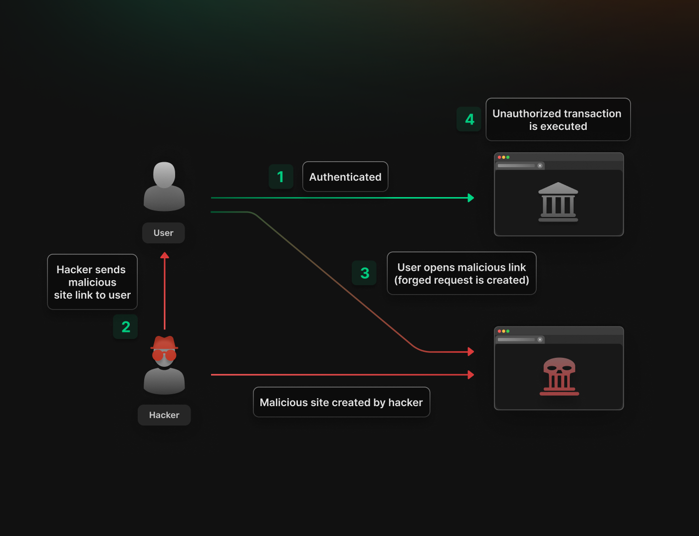
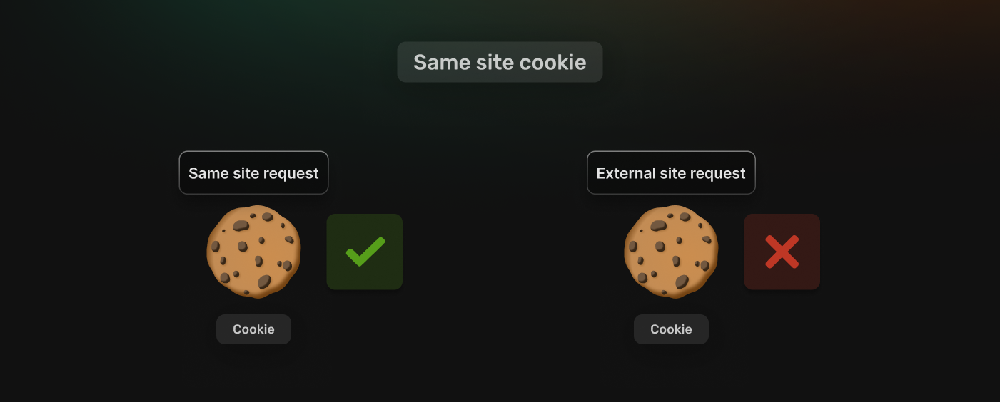

## Table of Content

- [Introduction](#introduction)
- [Understanding CSRF](#understanding-csrf)
- [CSRF in action](#csrf-in-action)
- [CSRF Prevention](#csrf-prevention-techniques)
- [Common CSRF Issues](#common-csrf-issues)
- [How SuperTokens fights CSRF attacks](#how-supertokens-fights-csrf-attacks)
- [Conclusion](#conclusion)

## Introduction

Welcome to this article, where we're diving deep into the world of Cross-Site Request Forgery (CSRF) attacks—a type of cyber threat that tricks users into executing unwanted actions on a web application where they’re authenticated. Imagine a scenario where, without even realizing it, you inadvertently grant a hacker access to your bank account with a single click. By the time you finish reading, you'll be armed with all the know-how to keep your web applications safe and secure from such insidious attacks. Without further ado, let's get started!

## Understanding CSRF

To start with, the attack is divided into four main steps.



- **1. Authentication**: The user logs into a legitimate website or web application, establishing a session with the server.

- **2. Exploitation**: While the user is still logged in, the attacker lures the user to click on a malicious link or visit a page that contains malicious code.

- **3. Forged Request**: To begin with, the attacker researches websites (eg: banks websites) that lack CSRF protection. Moving on, the malicious code embedded in the link or page sends a request to the such legitimate website on behalf of the user in order to perform a given transaction. If the user is authenticated to such sites (eg: through cookies), the website processes the request as if it came from the user and successfully completes it. 

- **4. Unauthorised Action**: The website executes the action requested by the attacker, such as transferring funds, changing account settings, or making purchases, without the user's knowledge.

In a CSRF attack, the attacker leverages the fact that you're already authenticated (logged in) to a website, and they trick you into unknowingly performing actions on that website. The malicious link or page you visit contains code that sends a request to the website using your existing session credentials, such as cookies, stored in your browser. The attacker then can perform malicious actions on the website as if they were you.

## CSRF in Action

**Authentication**:
Sarah logs into her online banking account to transfer money to her friend Emily.

**Exploitation**:
She receives a social media notification from John with a link to an article, which she clicks, leading her to a seemingly harmless but malicious site.

**Forged Request**:
Unseen by Sarah, the malicious site runs a script that, exploiting her active banking session, initiates funds transfer to an attacker's account.

```bash

```

While Sarah intended to send money to Emily, the legitimate transfer link would look something like this:

### Unauthorised Action:
Because Sarah is already logged into her online banking account, the request appears genuine to the banking website.


Without her knowledge or consent, the transaction is swiftly executed. Sarah remains oblivious to the fraudulent activity occurring in the background, as the funds are diverted to the attacker's account instead of Emily's.

Several days go by before Sarah realises something's wrong with her account balance. Surprised, she finds out about unauthorised money transfers from her account. Her innocent click on a link resulted in a considerable loss, despite her initial plan to help her friend Emily.

## CSRF Prevention Techniques

In light of these considerations, a crucial question emerges: Can we truly place our trust in any of our online transactions? The answer is yes as protective measures have been created to thwart such nefarious schemes as CSRF attacks.

So, while the thought of internet transactions might momentarily have you echoing the sentiment:


Rest assured as there is a wide range of effective yet not so hard to achieve techniques that can be used to prevent such malicious actions. Some of these methods to include: 

### 1. Double Submit Cookie
In the normal operation of web applications without specific CSRF protections, a session identifier is often the only token stored in a cookie and used to maintain the state between the client and the server. This is not enough to prevent a CSRF attack as this token would be sent automatically with a given valid session. 

Here is where the Double Submit Cookie Technique comes in handy, as it sends the CSRF token to the client in two ways: once as a cookie and once included in the request (as hidden form input or in AJAX request data).

For a request to be accepted by the server, the CSRF token in the cookie must match the CSRF token sent in the request payload.


### Anti-CSRF Tokens

Another solid option for preventing CSRF attacks is the utilisation of Anti-CSRF tokens. These tokens are unique, random values generated by the server and can be embedded within web forms or included in request headers.

The effectiveness of Anti-CSRF tokens lies in the principle that only the legitimate website, where the form resides, can generate and validate these tokens correctly. This mechanism distinguishes legitimate user requests from forged requests by attackers.

When a form is served to the user, the server includes an Anti-CSRF token within it, typically as a hidden input field for forms that result in state changes (e.g., POST requests). This ensures that every form submission includes this unique token as part of the form data, although it remains invisible to the user.

```
<input type="hidden" name="csrf_token" value="unique_token_value">
```
The hidden CSRF token in the web form is not accessible by third-party websites due to the same-origin policy, a critical browser security measure. This policy prevents scripts on other websites from reading the contents of the form or the hidden CSRF token value from the legitimate site. Consequently, even if an attacker can trick a user's browser into making a request to the site, they cannot include the correct CSRF token, which is required for the request to be processed by the server.

>Note that when compared to Double Submit Cookie approach, the Anti-CSRF Token approach can be seen as more secure due to its reliance on server-side token validation, but it may introduce more complexity in managing token lifecycle and storage.

### 3. SameSite Cookie Attribute

Simply put, a SameSite attribute(feature) is added to cookies and specifies how they should behave when sent in cross-site requests. Using such a technique, cookies can be restricted from being sent along with cross-site requests, thus mitigating CSRF attacks. 

More on the SameSite Cookie Attribute approach will be explained later on in the “How Supertokens Fights CSRF Attacks” section.

## Common CSRF Issues

### Lack of CSRF Protection 
Some authentication systems may not implement CSRF protection measures, leaving them vulnerable to CSRF attacks. Without proper safeguards such as anti-CSRF tokens or SameSite cookie attributes, attackers can exploit authenticated sessions to perform unauthorised actions.

### Weak Token Generation 
If CSRF tokens are generated using predictable or weak methods, they become susceptible to brute-force attacks. Tokens should be cryptographically secure and sufficiently random to prevent attackers from guessing or predicting them.

### Improper CORS Configuration
Misconfigurations in Cross-Origin Resource Sharing (CORS) policies can introduce CSRF vulnerabilities. Allowing overly permissive CORS settings can enable attackers to execute CSRF attacks from malicious websites by making cross-origin requests with user credentials.

### Insecure Authentication Flow 
Weaknesses in the authentication flow, such as transmitting authentication tokens over insecure channels or storing them insecurely, can expose users to CSRF attacks. Attackers may intercept or manipulate authentication tokens to impersonate legitimate users and execute unauthorised actions.

## How SuperTokens Fights CSRF Attacks


SuperTokens is an open-source library designed to enhance web application security by providing comprehensive solutions for authentication and session management. It addresses various security threats, including Cross-Site Request Forgery (CSRF), which poses a significant risk to web applications.

As stated earlier, CSRF attacks occur when unauthorized requests are made on behalf of authenticated users, exploiting their active sessions. SuperTokens offers robust mechanisms to mitigate CSRF vulnerabilities, ensuring the integrity and security of web applications.

### SuperTokens' Anti-CSRF Measures

SuperTokens employs several strategies to prevent CSRF attacks effectively. Let's delve into one of the main anti-CSRF measures provided by SuperTokens:

#### Strict SameSite Cookie Attribute

The SameSite cookie attribute is a security feature introduced in modern web browsers to mitigate certain types of cross-site request forgery (CSRF) and cross-site scripting (XSS) attacks. It allows developers to declare if and how cookies should be sent in cross-site requests, thereby enhancing security and privacy.

When a cookie is set with the SameSite attribute, the browser includes it only in requests that originate from the same site as the one that set the cookie. This helps prevent unauthorised websites from accessing sensitive cookies, such as session cookies, and reduces the risk of CSRF attacks.




Using SuperTokens the process of authenticating your system against CSRF along with XSS attacks becomes super easy. Here we can set the SameSite attribute of session cookies to "Strict" or "Lax" mode, preventing them from being sent along with cross-site requests. This reduces the risk of CSRF attacks by limiting the scope of session cookies to the same origin.

- **Lax**: Cookies will be sent only when the request is made from the same origin as the website that set the cookie (first-party context). Additionally, cookies will be sent along with GET requests initiated by third-party websites, but only if the request results in browser navigation, such as when a user clicks on a link.

- **Strict**: Cookies will exclusively be sent when the request originates from the same domain as the website that set the cookie (first-party context). Requests initiated by third-party websites will not include the cookies.

This way when a user clicks on a link generated from an external site, the SuperTokens authentication process will prevent the request from being sent to external sites other than the main site with the defined authentication.

## Conclusion
Despite the daunting presence of Cross-Site Request Forgery (CSRF) throughout the internet, efficient and robust defense mechanisms like SuperTokens, coupled with strategic security practices, have empowered us to safeguard our online interactions effectively. 

If we have focused on one thing throughout this article, it is the imperative necessity of employing anti-CSRF techniques. This commitment ensures the safety and integrity of web applications, establishing a secure and trustworthy digital environment for users.
