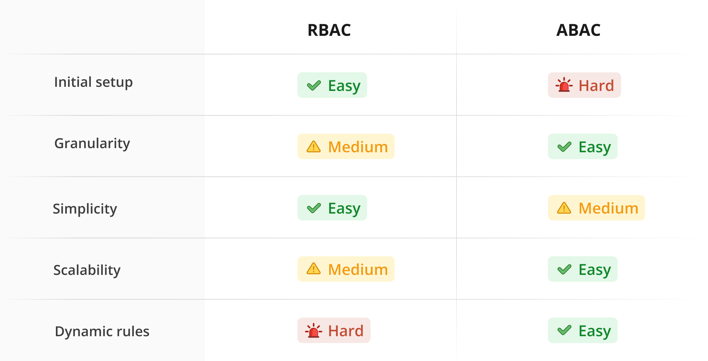

Roles-based access control (RBAC) is a security approach that uses roles to define what a user is and isn’t allowed to do. In a RBAC system, users are assigned roles with varying permissions for different resources, including files, databases, and applications.

So, when a user tries to access a resource, the system will first find the roles associated with the user and then check if any of the roles have the appropriate permission. If so, the user is allowed to access the resource. If not, the user is denied access.

For our example, we’ll be building a sample blogging app.

First, we have a `regular-user` role. We’ll want to allow regular users to read all blog posts, but only edit or delete posts created by them.

On the other hand, we create an `admin` role that allows admins to create, edit, and delete all blog posts.

So if a user with only the `regular-user` role tried to edit a blog post by another user, our system would see that the `regular-user` role doesn’t have the permission to edit that blog post and deny the request. 

## RBAC vs. ABAC?

As opposed to RBAC, Attribute-based access control (ABAC) is another security approach that assigns permissions based on user attributes, resource attributes, and environment attributes. For example, a design file can be restricted to users that have designer in their title and only accessed on weekdays.

While ABAC gives finer granularity over access to different resources, RBAC wins out on the ease of implementation. The initial setup cost of RBAC is magnitudes lower than ABAC.

With RBAC, companies have a straightforward method for grouping users with similar access needs and then assigning permissions to those groups.

With ABAC, companies must first define variables and configure different attribute-based rules, which can be a cumbersome process.




## Advantages of RBAC

Easy to understand: Because of its intuitive structure, the underlying business logic with RBAC is simple to communicate and understand – even with dozens of different roles.

- Extendibility: As you ship new features or change the application structure, adding or modifying roles can easily extend access to new resources for users that need them.
- Improving compliance: Using RBAC forces developers to think about and organize application permissions and access control. This information can then be used by compliance officers during audits.
- Decreased risk of data breaches / leakage: It becomes easy for developers to implement application security best practices around access control for their APIs, greatly reducing the chances of breaches.

## Disadvantages of RBAC
- Difficult to make exceptions: It can be complex to make exceptions to how a role works. In our example above, if we want to add a rule that users with `regular-user` role cannot edit their own post if they have already made ten edits, it will have to be added in the API logic as an exception. There is no way for the roles / permissions system to express it easily. This causes issues since we have to encode this rule in all places where we are checking for the `edit:self` permission.
- Role explosion: Because the only way to add granularity to a RBAC system is by creating a new role, we can end up with hundreds of different roles that are impossible to manage.
- Can cause conflicts in permissions: There could be situations in which a user is assigned two roles that have conflicting information. In our example, if a user is assigned the `admin` role and the `regular-user` role, they have `edit:self` and `edit:all` permissions to edit blog posts. Which one should take precedence? The precedence logic can be coded in the APIs, but this opens the possibility for errors.  
  
```ts
if (permissions.contains("edit:self")) {
	// only allow editing if the blog post belongs to the current user 
} 
else if (permissions.contains("edit:all")) {
	// allow editing 
}  
```  

Even thought our user has both the `admin` and `regular-user` roles, they will not be able to edit all the blogs because the `edit:self` statement is executed first while the `edit:all` rule get skipped in the following else-if statement.

## Implementing RBAC

At Supertokens, we’ve been thinking a lot about user authentication and authorization. In fact, it’s all that we do.

We recently [launched our user roles feature](https://supertokens.com/blog/introducing-user-roles-authorization-with-supertokens) based on RBAC principles, which can be set up in as little as 45 minutes!

You can learn more about how to use user roles and permissions features using SuperTokens via the [recipe guides docs](https://supertokens.com/docs/userroles/introduction).
