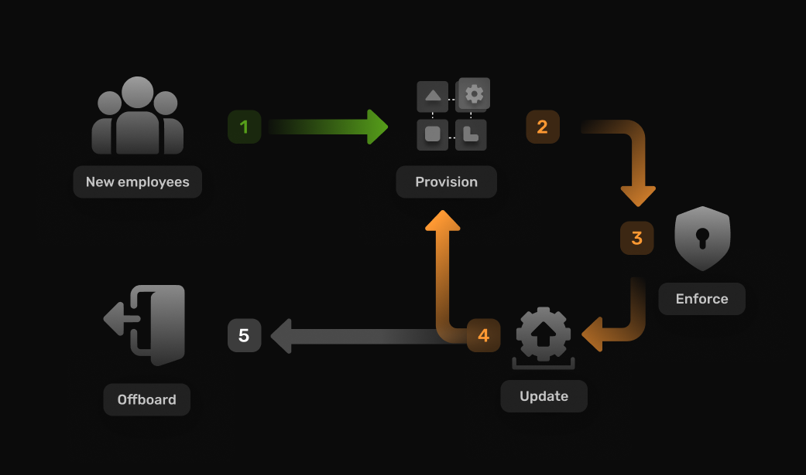

## Introduction

In 2024, a staggering 94% of enterprises use cloud applications. The key to improving employee productivity and job performance lies in making the communication between these tools as seamless as possible while providing the necessary security. Administrators play a pivotal role in guaranteeing quick access to essential resources while also maintaining the efficiency of promptly revoking access when it is no longer required.

SCIM (System for Cross-domain Identity Management), is a standardized and interoperable solution that  effectively manages the entire lifecycle of user identities within organizations. 

In this article we will delve into SCIM provisioning, highlighting its benefits, key features and how it differentiates from other identity management terms like SAML and OAuth.

## What is SCIM Provisioning?
SCIM provisioning is a standardized framework and set of API's designed to simplify and automate the provisioning of user identities accross different cloud systems and applications 

SCIM works by exchanging user identity attributes like a user’s profile, their access level and group association. This seamless exchange takes place between two entities: the identity provider (IdP), responsible for overseeing a platform's identity services, and the service provider (SP), which can be any compatible Software as a Service (SaaS) application



## Why is SCIM provisioning important

Many organizations choose to adopt SCIM today for different reasons, here are some common advantages to SCIM:

**1. Automation:** by supporting single-sign-on (SSO), SCIM automates user identity provisioning across multiple apps and tools using a single set of credentials. 
With this, it can minimize the need for manual intervention in user management processes. This not only reduces the administrative burden on IT teams but also helps mitigate the risk of human errors associated with manual provisioning.

**2.Consistency:** SCIM provides real-time synchronization of user identity attributes between the IdP and SP, with this synchronization it ensures any changes - whether those be updates to a user identity or deletes - are reflected across the different tools and applications consistently. 

**3.Security:** The standardized nature of SCIM helps improve security by providing a consistent and secure method for exchanging identity information. This reduces the likelihood of vulnerabilities associated with non-standardized or ad-hoc integration methods.

Within dynamic organizational landscapes, where employees frequently join or leave, SCIM ensures that onboarding and offboarding user identities happen automatically and in real-time while maintaining the highest security and compliance standards.

## How Does SCIM provisioning work?
SCIM 2.0 (the latest iteration of SCIM) is built on an object model where a Resource serves as the highest point in the hierarchy. All SCIM objects derive from this central Resource. These SCIM objects could either be ‘Users’ or ‘Groups’, with the flexibility to extend to custom or specialized objects like an EnterpriseUser that contains enterprise-specific attributes.

SCIM work by defining a schema and a set of APIs and for representing user identities:

- **Schema**: SCIM uses a standardized schema to represent user attributes. The schema defines a common structure for user data, ensuring that attributes like username, email, and role are consistently understood and processed across different systems. 

- **RESTful APIs:** SCIM relies on RESTful APIs, These APIs define a set of operations (create, read, update, delete) and resource endpoints (URLs) for managing user identities. Resource endpoints represent different aspects of user management, such as creating a new user, updating user details, querying for user information, and deleting user accounts. 
The standardized operations and resource endpoints make it easy for systems to communicate and maintain a consistent user identity lifecycle.

Below is an example of a POST request made to create a new object of type ‘User’:

```
POST /v2/Users  HTTP/1.1
Accept: application/json
Authorization: Bearer h480djs93hd8
Host: example.com
Content-Length: ...
Content-Type: application/json

{
  "schemas":["urn:ietf:params:scim:schemas:core:2.0:User"],
  "externalId":"johndoe",
  "userName":"johndoe",
  "name":{
    "familyName":"John",
    "givenName":"Doe"
  }
}
```

SCIM is designed to be vendor-neutral and interoperable. This means that organizations can implement SCIM across a variety of identity management systems and cloud applications, which promotes compatibility and integration in diverse IT environments.

Several cloud providers and identity management solutions offer SCIM implementations, [Microsoft Entra ID](https://learn.microsoft.com/en-us/entra/architecture/sync-scim) and [AWS IAM](https://docs.aws.amazon.com/singlesignon/latest/userguide/scim-profile-saml.html) are a few of [many](https://simplecloud.info/#Overview) players in the identity solution market. 


## SCIM vs SAML
SCIM and SAML (Security Assertion Markup Language), have distinct roles but often complement each other in identity and access management systems, here are some key differentiators between the two:


|  	| SCIM 	| SAML 	|
|---	|---	|---	|
| Purpose of Function 	| A system that is primarily focused on user provisioning and synchronization. It provides a standardized approach to creating, updating, and deleting user identities across different systems. 	| An XML based authentication standard that allows for federated identity management and can support single sign-on (SSO) 	|
| Data exchange 	| Involves the exchange of user identity information (e.g., user attributes, group memberships) between identity providers and service providers. 	| Involves the exchange of security assertions, including information about the user's identity, authentication status, and attributes, between the identity provider and service provider. 	|
| Use case 	| Ideal for scenarios where efficient user provisioning, synchronization, and identity management are the primary concerns, especially in cloud-based environments. 	| Ideal for scenarios demanding Single Sign-On (SSO) for user access within an organization as well as providing secure collaboration and access across different organizational boundaries. 	|

While SCIM and SAML address different aspects of identity and access management, they can complement each other in a comprehensive identity management strategy. SCIM focuses on user provisioning, while SAML is centered around secure authentication and single sign-on.

## Challenges with SCIM
Like any system, SCIM has many advantages when it comes to building an efficient and secure onboarding system. However, in large organizations with many systems and applications, this can also have present some challenges:

- **Schema mapping:** SCIM relies on a standardized schema for representing user and group data. However, different applications and systems may have their own unique schemas. Some service providers may have different schema specifications. Mapping these schemas can be challenging, and inconsistencies may arise during data transfer.

- **Compatibility Issues:** Not all service providers and identity management systems fully support SCIM, Microsoft Entra ID as an example has a list of incompatibility issues with SCIM 2.0 that require the use of feature flags  - this and other examples can result in added complexity when trying to establish connections with existing legacy systems.

- **SSO requirement:** To implement SCIM, organizations usually have to set up Single Sign-On (SSO), a step that smaller organizations might find complex or costly.

*Note:* As long as SAML or OAuth are being used, SSO implementation could not be easier with SuperTokens’s open-source SSO recipe, which offers quick support for 5 major identity providers as well as compatibility with any other identity provider. 

## SCIM vs SSO

Technically speaking SSO is a way to authenticate users enabling sign-in while SCIM is primarily a method of provisioning(creating accounts).

With SCIM, applications can request user details in a standardized way to be authenticated by the application. So a level of SSO can be achieved since a user can now authenticate with the same set of credentials across applications which use SCIM provisioning.

## Conclusion

In summary, SCIM serves as a protocol designed to facilitate the efficient streamlining of identity management. The benefits of SCIM, such as improved security, scalability, and streamlined user management, highlight its relevance in modern identity management ecosystems. We've covered SCIM definition, explored its benefits, and drawn comparisons with terms often used interchangeably, such as SSO and SAML.

For organizations seeking to implement SCIM, a thorough understanding of the standard's specifications, familiarity with service provider specifications, and meticulous planning are crucial. This ensures a smooth implementation without unnecessary complexities in the future.


