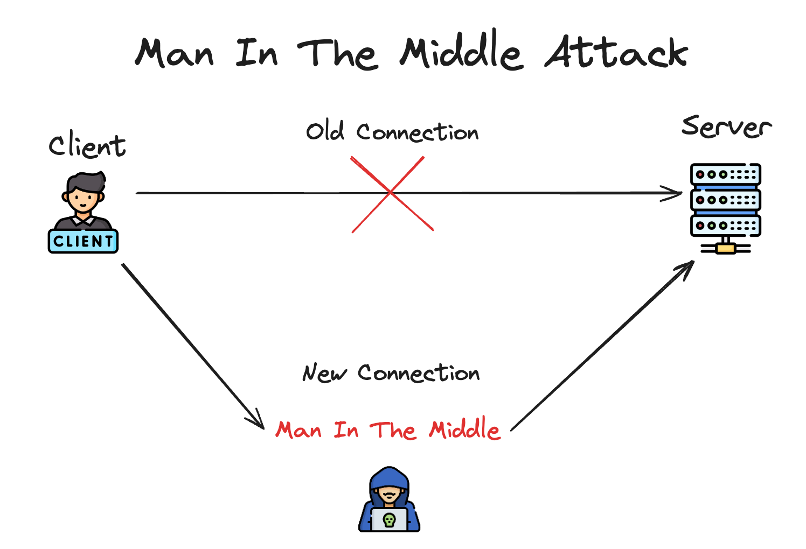
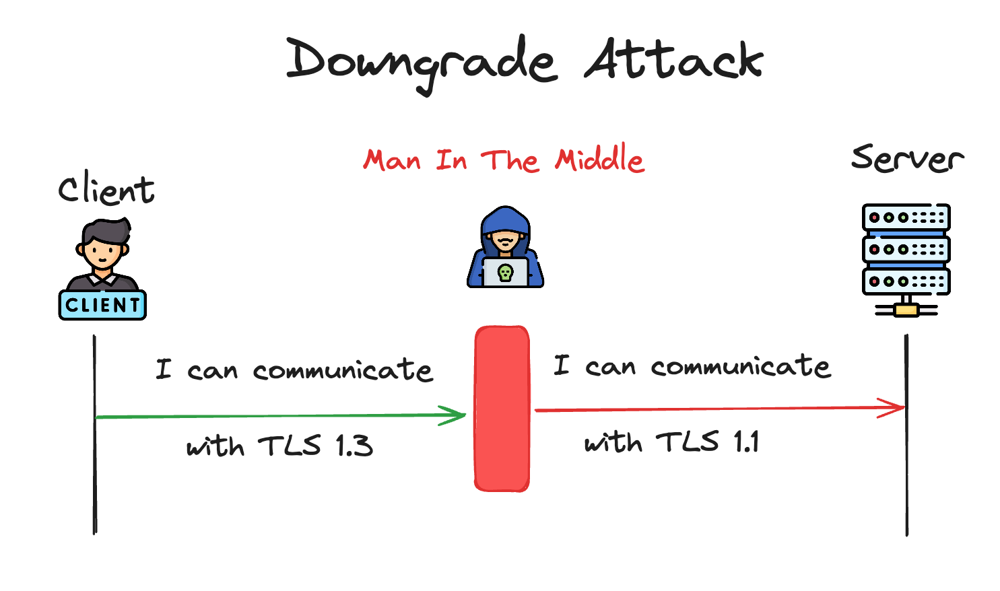

## Table of Content
- [Introduction](#introduction)
- [The TLS 1.3 Handshake Process](#the-tls-13-handshake-process)
- [TLS 1.3 Handshake Optimization](#tls-13-handshake-optimization)
- [Breaking the TLS Protocol and Its Future Trends](#breaking-the-tls-protocol-and-its-future-trends)
- [How Can You Keep Your Web Project Secure](#how-can-you-keep-your-web-project-secure)
- [Conclusion](#conclusion)

## Introduction
In 1944, Netscape introduced Secure Socket Layer(SSL) to secure Internet Communications, but it quickly became evident that SSL had it's flaws- vulnerable encryption, susceptibility to attacks, and slow performance. These weaknesses left the digital world exposed  to emerging threats, demanding a stronger solution.

Transport Layer Security(TLS) was the answer. Developed to overcome SSL's limitations, TLS brought to the table robust encryption, rigorous authentication, and solid integrity checks, ensuring data traveled securely from point A to point B.

Central to TLS is its meticulous handshake process, which verifies identities, agrees on encryption, and generates keys, fortifying online transactions against the vulnerabilities of the past. With TLS, Internet communication became not just safer, but faster and more reliable, marking a significant step forward in digital security.

## The TLS 1.3 Handshake Process

### Overview of the Handshake

The TLS handshake is a dynamic back-and-forth process that establishes trust between two parties, paving the way for secure communications over the Internet. Within this procedure, both parties engage in a dialogue to authenticate each other, ensuring a foundation of trust. The protocol intricately utilizes keys and encryption algorithms, negotiating the optimal set for the session at hand. This negotiation process ensures that all data exchanged is not only encrypted but also tailored to the security capabilities of both the client and the server.

### Step-by-Step Breakdown of The TLS 1.3 Protocol

In this section, we'll examine TLS 1.3, the latest and most up-to-date protocol. Later on, we'll explore the older more slower version which is the TLS 1.2, to highlight the advancements of the newer version over it.

#### 1. Initiation (Client Hello)
You know where their secure mailbox is, but you've never exchanged keys before. So, you drop a note in their mailbox saying, "Hi, I'm your friend, and I want to start a secure conversation. Here are the languages I can speak (types of encryption I can use), and here are some secrets (keys) I'm willing to use to help us understand each other." This is like the "Client Hello" message, where your browser (the client) reaches out to a website (the server) to initiate a secure connection, suggesting encryption methods it supports.

#### 2. Key Share. Certificate Verify. Finished.
- **Key Share**: Your friend receives your note and chooses a language (encryption method) that both of you know. This is where they share their own secret (key) for encoding messages, similar to choosing a specific, private language that only the two of you can understand. 
- **Certificate Verify**: To prove they are the rightful owner of the mailbox (and not an imposter), your friend shows you a badge (certificate) that a trusted authority has signed.
- **Finished**: After checking the badge, you both agree on a special, private language (a shared secret) for your conversation. This final agreement on a shared secret solidifies your communication channel's security.

#### 3. Start of the Meeting (HTTP request)
Now that you and your friend have agreed on how to communicate securely, you write your actual letter (request for a webpage or action on a website), put it in a sealed envelope that you encrypted and only your friend can open (decrypt), and send it through the mailbox. This represents the secure request your browser sends to the website, using the encryption method you both agreed on.

#### 4. Response (HTTP response)
Your friend receives your letter, opens the special envelope (decrypts the message), reads your request, and writes back with the information you asked for. They then put their response in another sealed envelope (encrypt it) and send it back for you. You open it (decrypt it) and read their message. And so on.

## TLS 1.3 Handshake Optimization
The TLS 1.3 protocol introduced several key improvements over its predecessor, TLS 1.2, specifically aimed at speeding up the handshake process and enhancing security. These improvements make TLS 1.3 not only more efficient but also significantly more secure compared to TLS 1.2.

### 1. Fewer Round-Trips
TLS 1.3 reduces the number of round trips required during the handshake to just one, in comparison to the 2 round trips needed by the older 1.2 version  (check below image). This is achieved by combining and simplifying several handshake messages.

### 2. Better Session Resumption

Although TLS 1.2 supports session resumption, TLS 1.3 enhances this feature significantly with the introduction of 0-RTT (Zero Round Trip Time) Data. This innovation allows encrypted data to be sent from the client to the server in the very first message upon resuming a session, thereby substantially reducing latency for applications that require quick response times.

### 3 Improved Security
- **Forward Secrecy**: TLS 1.3 mandates the use of ephemeral key exchange mechanisms, ensuring that each session has its unique encryption keys and enhancing forward secrecy.
- **Modern Cryptographic Algorithms**: TLS 1.3 deprecates older, less secure cryptographic algorithms and cipher suites, requiring the use of modern, more secure options that provide stronger encryption and integrity protection.

### 4 Simplified Protocol 
By removing outdated features and streamlining the protocol, TLS 1.3 reduces the potential for misconfigurations and vulnerabilities, making it easier to deploy securely.

## Breaking the TLS Protocol and Its Future Trends
Surely by now, you might think the internet has become a fortress of security, thanks to the TLS protocol, right? While it's true that Transport Layer Security (TLS) has significantly elevated the safety of online communications, it's important to remember that no system is impervious. Despite its sophistication and constant enhancements, TLS can still encounter specific vulnerabilities and be targeted by advanced attacks. 

In what follows, we'll delve into the methods that can potentially breach this protocol, underscoring the notion that even the most optimized security measures are not foolproof.

### 1. Man-in-the-Middle (MitM) Attacks
In a MitM attack, the attacker intercepts the communication between the client and the server to eavesdrop on or alter the data being exchanged. While TLS aims to prevent such attacks by encrypting the data and authenticating the server, vulnerabilities can arise from poorly configured servers or compromised Certificate Authorities (CAs).

Here, the attacker finds a way to insert themselves into the communication path between the client (e.g., a user’s browser) and the server (e.g., a website). This can be achieved through various methods, such as ARP poisoning in a local network.

This way, the attacker can decrypt and read the data if it’s not properly secured. They can alter the data before forwarding it to the intended recipient, potentially injecting malicious content or falsifying information.

Configuring servers to use strong encryption and the latest version of TLS can mitigate the risk of MitM attacks.

### 2. Downgrade Attacks
Even though the TLS 1.3 version is pretty secure the older ones aren't so much. The Downgrade attack, which can be thought of as a subset of the MitM attack, initiates the attack at an even more fundamental phase. As it tricks the communicating parties into using older, less secure versions of TLS (or SSL), which are known to have vulnerabilities.

When a client initiates a connection to a server, it sends a "ClientHello" message that includes the highest version of TLS it supports, along with a list of cryptographic algorithms (ciphers) it can use.

The attacker then intercepts this "ClientHello" message and modifies it before forwarding it to the server. The modified message indicates a lower maximum protocol version that the client can support, essentially lying to the server about the client's capabilities.

The server, believing it is complying with the client's capabilities, responds with a "ServerHello" message that agrees to use the downgraded protocol version. Now Attackers can exploit these vulnerabilities to decrypt or manipulate the communication.

## How Can You Keep Your Web Project Secure
Implementing up-to-date TLS protocols is crucial for securing authentication flows, protecting credentials, and ensuring the privacy of user sessions. As web applications become increasingly integral to our daily lives, the security of these applications, especially during the authentication process, becomes paramount. 

Up-to-date TLS protocols offer the latest in encryption techniques, vulnerability patches, and performance optimizations, providing a robust foundation for secure communications over the internet

For developers, adhering to best practices in secure development is essential for safeguarding web applications against emerging threats. Key practices include:

- **Disable Outdated Protocols**: Explicitly disable older protocols (such as SSL 2.0/3.0 and TLS 1.0/1.1) on both client and server sides to prevent their selection during the handshake process. Eliminating the possibility of them ever being used. This ensures that your server is only configured to use the latest version of TLS removing many outdated features and is designed to be more secure against various attacks, including downgrade attacks. 

- **Implement HTTPS Everywhere**: Use HTTPS, secured by TLS, for all pages and not just during login or checkout processes. This ensures that all data transmitted between the client and server is encrypted, further protecting users' privacy and security.

## Conclusion
In conclusion, the evolution from SSL to TLS 1.3 marks significant strides in internet security, yet vulnerabilities persist, reminding us of the ongoing battle against cyber threats. It is crucial for developers to implement the latest TLS standards and secure coding practices, and for users to remain vigilant. Together, through adopting these measures and embracing HTTPS universally, we can strengthen the web's defenses and safeguard our digital communications against emerging threats.

