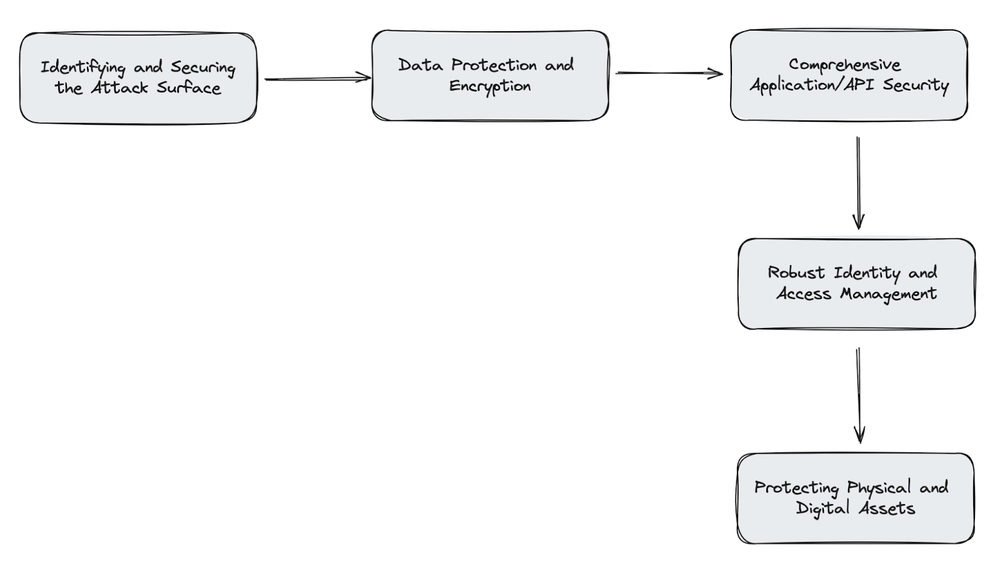
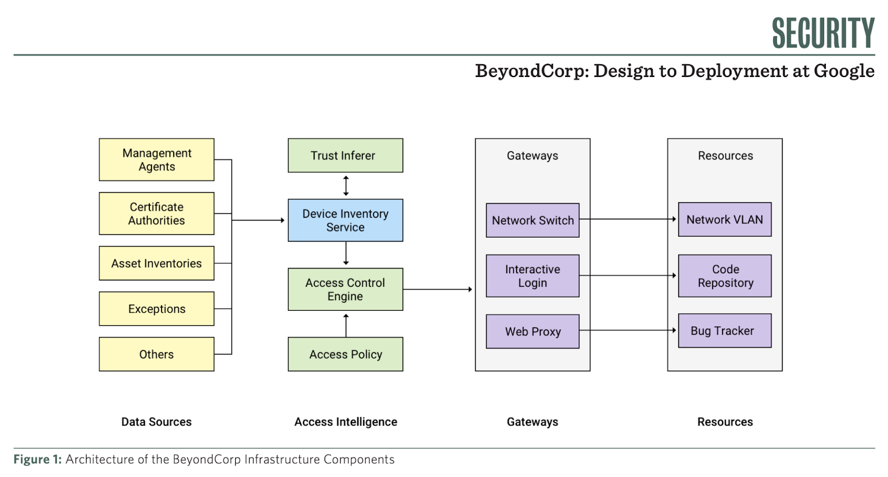

## Introduction

In traditional IT network security, the network trusts anyone or anything inside the network. It follows the [castle-and-moat](https://www.cloudflare.com/learning/access-management/castle-and-moat-network-security/) model where no one outside the network is able to access data on the inside, but everyone inside the network can. The problem that arises is that once an attacker gains access to the network, they have complete access to all resources. The Zero trust model requires strict verification for every person or device trying to access resources on a private network, regardless of whether they are within the network perimeter or not. Zero trust is a holistic approach to network security that incorporates several principles and technologies.

In this article we delve into its evolution, unravel its core principles, and journey through real-world case studies that unveil its practical benefits. 

## The Main Concept Behind Zero Trust

**"Never Trust, Always Verify" - The Core Principle of Zero Trust**

Zero Trust security, is a paradigm shift that places a premium on skepticism and verification. At its core, Zero Trust operates on the principle of "never trust, always verify." This means that no entity, whether inside or outside your network perimeter, is granted implicit trust. Every user, device, or network request must undergo rigorous verification and authorization processes, regardless of their location or origin.

*In essence, Zero Trust represents a philosophy that embraces caution, prioritizing security over convenience.*

## Key Principles of Zero Trust

### Micro-Segmentation: Controlling Access to Network Resources
One of the cornerstones of Zero Trust is **micro-segmentation**. As the name might imply, this process involves dividing your network into smaller, isolated segments or zones. These segments serve as individual barriers, preventing lateral movement within the network in case of a breach.

Micro-segmentation enables organizations to compartmentalize their resources, ensuring that only authorized users and devices can access specific segments. This fine-grained control limits the potential **attack surface**, making it significantly more challenging for cyber threats to spread within the network.

### Least Privilege Access: The Principle of Minimalism
**Least Privilege Access** is key to Zero Trust security. It ensures that users and devices are granted only the access needed for their tasks, minimizing the risk of unauthorized access and potential damage from compromised accounts. This approach effectively reduces the attack vector, making it harder for malicious actors to exploit resources that they shouldn’t have.

### Multi-factor Authentication (MFA): Verifying User Identities
**Multi-factor Authentication**, commonly referred to as MFA, **adds additional layers of security to the authentication process**. Beyond just a password, MFA requires users to provide two or more factors to verify their identity. 

A common method is sending a One-Time Verification code to the user's mobile device. Websites can also use authenticator apps like Google Authenticator or Authy. These apps generate time-based verification codes that users enter during the login process.

## Benefits of Zero Trust

### Scalability and Flexibility
Zero Trust security models can adapt to the changing size and complexity of an organization, making them suitable for businesses of all sizes.

### Increased Visibility and Control
Zero Trust models provide greater visibility into network traffic and user activities, allowing for better detection and response to potential threats.

### Adaptability to Remote Work
With the increase in remote work, Zero Trust is particularly relevant. It's designed to securely manage access regardless of where users are located, making it a robust solution for modern, distributed workforces. As we will see further on in our Cimpress case study.

## How to Implement Zero Trust into Your Application
Here are five key components or steps that companies must implement to successfully adopt a zero trust model.

## 1. Identifying and Securing the Attack Surface
- **Initial Assessment**: Identify potential vulnerabilities in the network and web platforms.
- **Infrastructure Segmentation**: Implement VLANs and network firewalls for segregation and control of network traffic.

## 2. Data Protection and Encryption
- **Data Classification**: Prioritize safeguarding sensitive data across the network and within applications.
- **Encryption Implementation**: Classify and categorize data to apply appropriate encryption and access measures, using [TLS 1.3](https://www.cloudflare.com/learning/ssl/why-use-tls-1.3/) and [AES encryption](https://www.simplilearn.com/tutorials/cryptography-tutorial/aes-encryption) standards.
- **Data Leakage Prevention**: Implement [Data Leakage Prevention](https://www.microsoft.com/en-us/security/business/security-101/what-is-data-loss-prevention-dlp) tools for monitoring data transfer and preventing leaks.

## 3. Comprehensive Application/API Security
- **Application Layer Security**: Secure critical applications with Web Application Firewalls (WAFs) and Runtime Application Self-Protection (RASP).
- **API Management**: Apply OAuth 2.0 and OpenID Connect for secure and delegated authorization.
- **API Gateway Protection**: Protect API gateways using OAuth 2.0 scopes, JSON Web Tokens (JWT) for secure data transmission between services, and mutual TLS (mTLS) for service-to-service authentication.

## 4. Robust Identity and Access Management
- **IAM Framework Implementation**: Use a [secure identity and access management](https://supertokens.com/) solution for managing access to services and web applications.
- **MFA Integration**: Implement Multi-factor Authentication (MFA) at both the network and application levels.

## 5. Protecting Physical and Digital Assets
- **Physical Security Extension**: Extend Zero Trust principles to physical devices and endpoints with [Endpoint Detection and Response (EDR)](https://www.trellix.com/security-awareness/endpoint/what-is-endpoint-detection-and-response/) that is installed on endpoint devices such as laptops, desktops, and servers  Moreover, utilization of hardware security modules (HSMs).
- **Verification and Authorization**: Ensure strict verification and authorization for physical and digital access, enhancing security for both corporate resources and application services.

## BeyondCorp: Google's Implementation of Zero Trust
Google is a prime example of a company that has embraced the zero-trust model to enhance its cybersecurity. They adopted a strategy called "BeyondCorp," which shifts the focus from traditional network security to a more user- and device-centric approach.

Google’s BeyondCorp strategy adopts Device Trustworthiness, User Identity Verification, Least Privilege Access, and Continuous Monitoring and Analytics.

In this section, we'll delve into various Zero Trust approaches mentioned in the BeyondCorp research papers. These papers explore how a world-renowned company like Google implements specific techniques and approaches to develop its unique Zero Trust Model.

### [BeyondCorp 6: Building a Healthy Fleet](https://storage.googleapis.com/gweb-research2023-media/pubtools/pdf/b9b4a09a913e410b7c45f3fbacec4d350e38146f.pdf)
The main focus of this research paper is emphasizing the importance of protecting sensitive data on devices, including encryption of data at rest and in transit. This is a critical aspect of ensuring that any sensitive information stored on or accessed by the devices is secure from unauthorized access, especially in scenarios of device loss or theft.

Moreover, in this paper, Google places significant emphasis on several key security measures. These include the implementation of comprehensive logging and log collection for threat detection, the use of hardware-backed or hardware-isolated credentials in systems, the restriction of unauthorized code execution on platforms, and the deployment of a cryptographically verifiable integrity mechanism for the platform.

### [BeyondCorp: Design to Deployment at Google](https://storage.googleapis.com/gweb-research2023-media/pubtools/pdf/44860.pdf)

The primary objective in this research paper, is to enhance security in accessing internal applications, moving away from traditional perimeter security models. Access is not based on physical location or network origin but on device state and user association.

**Some Fundamental Components that where followed in this paper do include:**

- **Trust Inferer**: Analyzes and annotates device state, setting the maximum trust tier accessible by the device and assigning VLAN on the corporate network.
- **Device Inventory** Service: Continuously collects, processes, and publishes data about the state of devices.
- **Access Control Engine**: A centralized policy enforcement service that provides binary authorization decisions.
- **Access Policy**: A programmatic representation of Resources, Trust Tiers, and other predicates necessary for authorization.
- **Gateways**: Include SSH servers, Web proxies, or 802.1x-enabled networks that control access to resources.
- **Resources**: All applications, services, and infrastructure subject to access control, each associated with a minimum trust tier.

## [BeyondCorp and the long tail of Zero Trust](https://www.usenix.org/publications/loginonline/beyondcorp-and-long-tail-zero-trust)
The main focus of this paper is addressing the latter stages of Google's BeyondCorp migration, focusing on specific or challenging situations that required innovative solutions beyond their core HTTPS-based workflow.

Initially, Google transitioned from a privileged, legacy network to a more secure MNP(Managed Non-Privileged) network. This involved reconfiguring workflows to function within the Zero Trust framework, particularly those relying solely on HTTPS traffic.

Moreover, to support tools requiring arbitrary IP connectivity, Google developed a micro-segmented VPN, offering fine-grained network access and integrating with BeyondCorp access decision mechanisms.

## Zero Trust in Action

### Case Study: Cimpress' Implementation of Zero Trust

#### Issue Faced

Cimpress, widely recognized for its new rebrand as Vistaprint, faced a unique challenge due to its structure comprising numerous autonomous business units operating in over 20 countries with more than 16,000 employees. 

The main issue was that each subsidiary managed its own technology stack, leading to a diverse and complex technology environment. This structure presented significant challenges in managing cybersecurity consistently across all units. The decentralized nature of their operations meant that traditional perimeter-based security models were no longer effective, creating a need for a more flexible and robust security architecture.

The issue was further highlighted during the COVID-19 pandemic, Cimpress Security's Zero Trust model was pivotal in ensuring business continuity as it effectively managed remote work challenges, maintaining secure connectivity across various devices and network environments while also mitigating increased cybersecurity risks. 

#### Solution
Cimpress embarked on a strategic move towards a zero-trust architecture under the guidance of Chief Security Officer Iftach Ian Amit. The implementation was driven by the principle of “never trust, always verify.” Key aspects of the solution included:

- Ensuring valid authentication and authorization for every access request.
- Implementing least privilege access controls.
- Reducing reliance on perimeter-based controls in favor of authenticated/authorized access.
- Emphasizing segmentation and micro-segmentation.

The Zero Trust architecture was centered around major cloud providers like AWS, Azure, and Google Cloud, ensuring that all processes and technologies adopted were environment-agnostic. This approach was pivotal in catering to the needs of cloud-reliant or cloud-native business units.

This case study exemplifies how a large, distributed company like Cimpress successfully navigated the complexities of implementing a zero-trust architecture across a diverse set of technologies and business units, enhancing its overall security posture while maintaining operational flexibility.

For a detailed exploration of the case study, please visit the following link: [Cimpress Zero Trust Case Study](https://www.isaca.org/resources/isaca-journal/issues/2021/volume-2/building-a-zero-trust-architecture-to-support-an-enterprise).

## Conclusion
Zero Trust security marks a revolutionary shift in cybersecurity, prioritizing continuous verification, and proactive defense. Real-world examples, including Cimpress, vividly illustrate the tangible advantages of this approach. From bolstering security to seamlessly adapting to evolving landscapes, Zero Trust is undeniably the future of cybersecurity.
