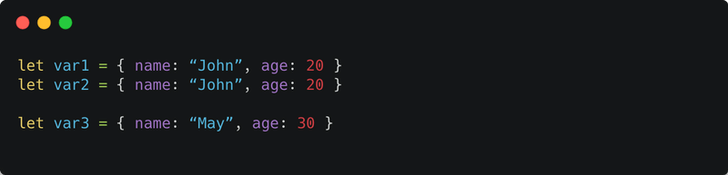
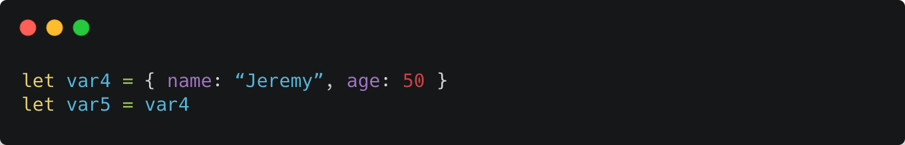
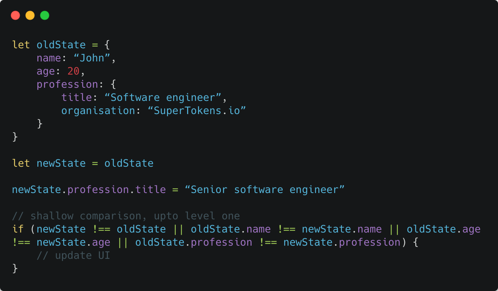

For redux to work correctly, the state must be immutable. This means that whenever we update the redux state, we have to create a copy of the whole state and set values to fields we want to change. In code, this usually looks like:

In the code above, we are modifying the oldState’s `field2` value by creating a new state and setting a new value to `field2`. The value and reference of `oldState` remains the same.

Before we get into why we must change redux state in this way, we should know the difference between “value” and “reference”

## Difference between value and reference

The value of a variable is the “semantic” meaning of what that variable holds. For example, in the example code below, the semantics of what is held by `var1` and `var2` are the same, therefore we can say that their values are the same. However, `var3`’s value is different since the “semantics” of what it’s holding is different.

When we talk about reference, we are referring (pun intended!) to the memory address of where something is stored. So in the above example, the memory address of the object referenced by `var1`, is different from the memory address of the object referenced by `var2`. In other words, `var1` points to a different memory address than `var2`. Therefore, their references are different, even though their values are the same!

The only way two variables can have the same reference is when they are both pointing to the same memory address. So in the code below, `var4` and `var5` have the same reference:

If we do `var5.name = “Mary”`, then the value of `var4.name` will also be “Mary”.

Based on this understanding, we can conclude:

- If the value of two variables are the same, their reference may or may not be the same.
- If the values of two variables are different, then their references must be different.
- If the reference of two variables are the same, their values must be the same.
- If the reference of two variables are different, their values may or may not be the same.

### Re rendering of react components

Coming back to redux and react, react will only want to re render a component if the value of the props or state has changed. To know if a value of these have changed, we must do a “deep comparison” - recursively check all the fields inside the state and prop to see if any of them have changed. 

Large applications usually have a very deep state structure when using redux - several nested levels (in the count of 100s or even 1000s). Doing a deep comparison here, perhaps several times every second, will slow down the UI. On the other hand, if we do a “shallow comparison” (where we only check if the values of the first level fields have changed), it will be much quicker, but we may miss out on updates - breaking application logic. An example of how we might miss out on updates with shallow comparison is presented below:

In the if statement above, the UI won’t update, even though we intended to change the state. This is because the reference of `newState.profession` is equal to oldState.profession.

Also notice above that when we do `oldState.profession !== newState.profession` or `newState !== oldState`, we are actually checking if their reference (and not value) is the same (they are all objects).

### Optimising with the immutability rule

The problem of rerendering could be solved if we could somehow just do a shallow reference check, without missing out on updates. This would give us the performance we need and not break the application’s logic.

Based on what we saw in the previous sections, we know that “if the reference of two variables (state variables in this case) are different, their values may or may not be the same.”. What if we change this to “if and only if the reference of two variables (state variables in this case) are different, we should assume that their values are different.”. What happens now?

If the above change is enforced, then to know if a state’s value has changed, we can just do a reference check like `oldState === newState` (if this is `false`, then the reference has changed). If the reference has changed, then we can assume that the values must have changed and trigger a render. If not, then we do not rerender.

To enforce this assumption, we must never directly change the fields inside `oldState`. Instead, we must always create a new copy of oldState (in `newState`), just like we showed at the start of this article, and make modifications in `newState`. Since `newState` is a new object, its reference will always be different than that of `oldState`. This is known as enforcing immutability of state - exactly what redux enforces its users to do!

### Conclusion

Immutability of redux state is necessary since it allows detecting redux state changes in an efficient manner. This implies that whenever we want to modify a redux state, we must create a new copy of it and do modifications to that copy - which then becomes the new redux state.

