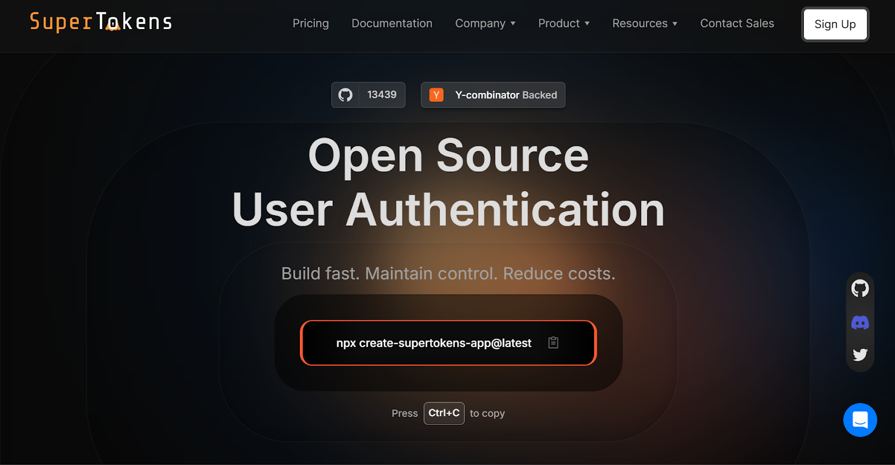

Early traction for any startup depends on a friction-free signup and login experience. Yet one poorly implemented authentication flow or a
single security breach can destroy user trust, halt funding conversations, and stall growth. Startups walk a fine line: authentication must be simple enough to accelerate adoption, but robust enough to satisfy investors, customers, and regulators.

This article explores what "auth for startups" really means, the core features required at different stages of growth, the hidden costs of
building authentication in-house, and why solutions like **SuperTokens** offer a pragmatic path forward for early-stage founders.

## What "Auth for Startups" Really Means

Authentication requirements evolve dramatically as startups mature from initial prototype to enterprise-ready platform. What suffices at the prototype stage quickly becomes a significant liability when user numbers grow exponentially or enterprise clients demand higher security and compliance standards. Understanding these evolutionary phases helps founders make informed decisions about authentication investments and avoid costly technical debt.

**Day 0: Core Requirements**

-   **Email/Password Authentication**: Still the most widely used baseline for user signup and account creation. This fundamental mechanism provides the entry point for user registration while maintaining familiar user experience patterns that reduce onboarding friction.
-   **Password Reset**: A mandatory user recovery mechanism that handles inevitable account lockouts and forgotten credentials. Secure implementation requires email verification, temporary reset tokens with short expiration windows, and proper session invalidation to prevent unauthorized access.
-   **Session Management**: Secure handling of authentication tokens, cookies, and user state across browser sessions. Proper
implementation includes token expiration policies, secure cookie configuration, and session storage that protects against common web vulnerabilities like XSS and CSRF attacks.

**Day 30&mdash;180: Growth Essentials**

-   **Social Login**: Lowers signup friction significantly and enables faster user adoption by leveraging existing accounts from Google GitHub, LinkedIn, or other trusted providers. This feature reduces abandonment rates during registration while providing verified email addresses and basic profile information.
-   **Multi-Factor Authentication (MFA)**: Provides essential layered security to dramatically reduce breach risk and protect high-value user accounts. Implementation options include SMS codes, authenticator apps, or hardware tokens, with app-based TOTP being the most cost-effective solution for startups.
-   **Token Theft Detection**: Prevents dangerous session hijacking attacks and credential misuse through automated monitoring of login patterns. Advanced detection includes geographic anomalies, device fingerprinting, simultaneous session analysis, and behavioral pattern recognition to identify compromised accounts.

**Series A and Beyond: Enterprise Readiness**

-   **Single Sign-On (SSO)**: A standard requirement for B2B enterprise deals that enables centralized identity management through existing corporate systems like Okta, Active Directory, or Azure AD. SSO integration often becomes a mandatory checkbox for enterprise procurement processes and significantly accelerates sales cycles.
-   **Audit Logs**: Enables comprehensive compliance evidence collection and detailed security incident analysis required for [SOC 2](https://secureframe.com/hub/soc-2/what-is-soc-2), [GDPR](https://gdpr-info.eu/), [HIPAA](https://www.hhs.gov/hipaa/index.html), and other regulatory frameworks. Proper audit trails include user actions, administrative changes, login events, and system modifications with immutable timestamps and digital signatures.
-   **Role-Based Access Control (RBAC)**: Manages increasingly complex user hierarchies, permissions, and entitlements across different
organizational levels. Advanced [RBAC](https://supertokens.com/blog/what-is-roles-based-access-control-vs-abac) systems support dynamic role assignment, attribute-based permissions, and granular resource access controls that scale with enterprise organizational structures.

In short, "auth for startups" is not static. It must expand in sophistication as the product, user base, and business model evolve.

## Five Must-Have Authentication Features for an MVP


Even at the earliest stage, some authentication features cannot be compromised without risking catastrophic consequences. A weak baseline
threatens both company reputation and future scalability potential, making these core components non-negotiable for any startup serious
about long-term success.

1.  **Secure Session Management**

    -   Implement short-lived access tokens (15-60 minutes) paired with longer-lived refresh tokens to balance security with user experience.
    -   Rotate refresh tokens on each use to dramatically limit exposure windows in case of credential theft or session compromise.
    -   Configure secure cookie attributes including HttpOnly, Secure, and SameSite flags to prevent client-side tampering and cross-site attacks.
    -   Implement proper token storage mechanisms that avoid localStorage vulnerabilities while maintaining seamless user sessions.

2.  **Password Policy and Hashing**

    -   Use cryptographically strong algorithms such as **bcrypt** with appropriate work factors or **Argon2** for memory-hard password protection.
    -   Never store passwords in plaintext, reversible formats, or weak hashing algorithms like MD5 or SHA-1 that can be cracked easily.
    -   Enforce reasonable password complexity requirements that balance security with user experience, typically 8+ characters with mixed case or special characters.
    -   Implement password history tracking to prevent users from reusing recently compromised passwords during security incidents.

3.  **Email Verification**

    -   Significantly reduces fake account creation, burner email abuse, and spam registration attempts that can degrade service quality.
    -   Essential for establishing trust and maintaining email deliverability rates with major providers like Gmail and Outlook.
    -   Provides verified communication channels for critical security notifications, password resets, and account recovery procedures.
    -   Enables proper user engagement tracking and reduces customer acquisition costs by filtering out low-quality signups early.

4.  **Forgot-Password Flow with Rate Limiting**

    -   Must implement comprehensive protection against brute force attacks, account enumeration, and automated password reset abuse.
    -   Ensure that reset tokens are cryptographically secure, single-use only, and expire within 15-30 minutes to minimize attack windows.
    -   Include proper rate limiting per IP address and per email account to prevent both distributed and targeted attacks.
    -   Invalidate all existing sessions upon password reset completion to prevent unauthorized access through compromised tokens.

5.  **Instrumentation and Alerts for Login Anomalies**

    -   Capture comprehensive login success and failure patterns, including timestamps, IP addresses, user agents, and geographic locations.
    -   Set up automated alerts for suspicious activity patterns such as multiple failed attempts, logins from new geographic regions, or unusual timing.
    -   Implement real-time monitoring dashboards that provide visibility into authentication system health and potential security incidents.
    -   Track key metrics including login conversion rates, password reset frequency, and MFA adoption to identify user experience issues early.

By implementing these features, startups can protect users without creating unnecessary friction in the MVP stage.

## Hidden Costs of Rolling Your Own Auth

Many founders initially assume building authentication in-house will save money. In reality, the opposite is often true. Below is a breakdown of hidden costs and their impact.

| **Cost Bucket**       | **Impact on Startups**                          | **Data Point**  |                                                                     
|------------------------|------------------------------------------------|------|
| Engineering Time       | Diverts builders from core product features     | Developers spend >40% on maintenance, reducing time for innovation &mdash; [DevPro Journal](https://www.devprojournal.com/software-development-trends/app-developers-are-spending-too-much-time-on-upkeep/) |
| Security Expertise     | Ongoing cryptography upkeep, penetration testing, and fixes | External audits cost $15,000–$30,000 per year for small teams &mdash; [Bright Defense](https://www.brightdefense.com/resources/soc-2-audit-costs/) |
| Breach Fallout         | Direct cost of incident management and lost trust | SMBs face breach costs ranging from $120,000 to $1.24M &mdash; [PurpleSec](https://purplesec.us/learn/data-breach-cost-for-small-businesses/) 2025 study |
| Compliance Overhead    | Evidence collection for SOC 2, GDPR, and ISO audits | Adds weeks to closing enterprise deals &mdash; [WorkOS](https://workos.com/blog/build-vs-buy-part-i-complexities-of-building-sso-and-scim-in-house) data |

DIY authentication often introduces **opportunity cost**: the product roadmap slows down while engineers patch vulnerabilities, update
dependencies, or handle compliance paperwork.

## Build vs. Buy&mdash;Decision Matrix for Startup Stages

The right strategy depends on stage and priorities.

|      **Stage**        |       **DIY Viable?**     | **Outsourced Recommended?**|         **Rationale**                               |  
|-----------------------|---------------------------|----------------------------|----------------------------------------------------- |
|Pre-seed / Prototype   | ⚠️ Time-boxed spike only |✅ Yes                      | Ship faster, prove product-market fit                |   
|Seed (User Growth)     | ❌ No                    |✅ Yes                      | Scalability, uptime, and security posture needed     | 
|Series A (Enterprise)  | ❌ No                    |✅ Yes                      | Enterprise clients demand SSO, audit logs, compliance|
                                                                                                                          
For most startups, outsourcing authentication from Day 1 ensures that resources remain focused on innovation, not on reinventing authentication protocols. 

## Security Best Practices When Resources Are Tight

Founders must apply baseline practices to avoid preventable security issues, even before hiring a dedicated security team.

-   Always default to **HTTPS** with **Secure/HttpOnly cookies**.
-   Use **short-lived access tokens**, and rotate refresh tokens at every use.
-   Store credentials and secrets in **environment variables or secret managers**&mdash;never in code.
-   Automate **dependency scanning** with tools such as GitHub Dependabot or Snyk.
-   Enable **MFA** for founder, admin, and root accounts from the very beginning.

These measures cost little but drastically reduce the risk of breaches.

## How SuperTokens Fits a Startup's Needs



[SuperTokens](https://supertokens.com/) offers a practical middle ground: founders can self-host a secure, open-source solution with minimal cost, and upgrade to managed cloud when user volume increases.

**Key Benefits for Startups**

-   **Open Source Core** eliminates license fees entirely for self-hosted deployments. A single Docker command boots the complete authentication system, reducing infrastructure complexity while maintaining cost control. The open-source model ensures no vendor lock-in as companies scale.
-   **Drop-In Recipes** provide pre-built authentication flows for common scenarios. Email and password authentication, social login integration, passwordless authentication, MFA, and passkeys all ship as configurable recipes rather than custom implementations. This approach reduces development time from weeks to hours.
-   **Built-In Session Rotation and Theft Detection** mitigate breach impact automatically. The system handles refresh token rotation, suspicious login detection, and session management without custom code. These enterprise-grade security features activate by default rather than requiring additional implementation.
-   **SOC 2 and GDPR-Ready Architecture** accelerates enterprise sales cycles. The authentication system ships with audit logging, data residency controls, and privacy features required for compliance certifications. Enterprise customers can review existing compliance documentation rather than auditing custom authentication implementations.
-   **Flexible Hosting** supports startup growth trajectories. Teams can start with self-hosted deployments on existing infrastructure,then migrate to managed cloud hosting as traffic and complexity increase. This flexibility prevents costly migrations while supporting scaling requirements.

### **Quick Start Checklist (\< 2 hours)**
```bash
 # Run SuperTokens Core with PostgreSQL                                                                                                 
 docker run supertokens/postgresql   
```                              
**Backend Setup**
```js
 EmailPassword.init();                                                                                                                  
 Session.init();                                                       
```
**Frontend Setup**
```js
 // React SDK                                                                                                               
 import SuperTokensReact from "supertokens-auth-react";  
```             
**Enable MFA**
```js
 TOTP.init();                                                                                            
 MultiFactorAuth.init(); 
 ```                                              
**Production Configuration**
```js
 cookieDomain: "yourdomain.com",                                                             
 apiBasePath: "/auth"                                            
```

This quick-start workflow allows even small teams to stand up secure authentication without weeks of development effort.

## Budget-Friendly Roadmap for Founders

A phased approach ensures startups control costs while preparing for scale.
                                                                                                
|  **Dimension** |              **Milestone**                |     **Estimated Cost**                              | 
|----------------|-------------------------------------------|-----------------------------------------------------|         
|    Week 1      |  MVP authentication with SuperTokens OSS  |   \$0 infra + dev time                              |
|    Month 2     |  Enable social login and MFA                |   \$0 (recipe config)                               |
|    Year 1      |  Switch to managed cloud (100K MAU)       |   \$99&mdash;\$299/month (startup discounts available)   |
                                                                                      
This roadmap balances immediate needs with future-proof flexibility.

## **Startup Stories&mdash;Learning From Peers**

-   **FinTech Seed Round** companies face particularly strict security requirements due to financial data handling. One seed-stage fintech startup discovered token theft vulnerabilities during their first penetration test after building custom authentication. Migration off DIY eliminated the security risks and launched within three days, allowing the team to focus on core financial product features rather than security remediation.
-   **B2B SaaS Series A** companies often encounter SSO requirements during enterprise sales cycles. A Series A B2B SaaS company added SSO integration through SuperTokens Enterprise to close a six-figure enterprise deal within one week. The rapid implementation prevented deal delays while providing the compliance foundation for future enterprise sales.

## **Future-Proofing&mdash;What\'s Coming Next**


Authentication is no longer just about solving today's challenges. The next wave of innovations, threats, and regulations is already shaping the landscape. Here's what's coming next and how systems must evolve to keep pace.

-   **Passkeys Adoption** represents the future of passwordless authentication. Hardware-bound credentials eliminate password-based attacks while providing a superior user experience. Authentication systems must support flexible credential types to accommodate passkey rollouts across major platforms and devices.
-   **AI-Driven Credential Stuffing** attacks are becoming more sophisticated through machine learning optimization. Defense requires refresh token rotation and anomaly detection hooks that identify AI-generated attack patterns. Traditional rate limiting alone cannot stop AI-powered attacks that mimic legitimate user behavior.
-   **Region-based data Residency** requirements continue expanding through regulatory frameworks. Authentication systems must support deployment in EU, APAC, and on-premises environments to satisfy data sovereignty requirements. Cloud-native architectures enable regional deployment without architecture changes.

Forward-looking teams position themselves not just for compliance, but for competitive advantage.

## Conclusion&mdash;Focus on Product, Not Login Screens

For startups, every sprint and dollar counts. A purpose-built solution like [SuperTokens](https://supertokens.com/) delivers
enterprise-grade authentication&mdash;minus the hidden costs&mdash;so founders can ship features, win users, and scale with confidence.

Authentication represents table stakes rather than competitive differentiation for most startups. Investing engineering resources in login screens diverts talent from core product features that actually differentiate companies in their markets. External authentication solutions eliminate this opportunity cost while providing superior security and compliance outcomes.

The decision between building and buying authentication should consider total cost of ownership rather than just initial implementation effort. Hidden costs including security expertise, compliance overhead, and breach risks often exceed the visible costs of external solutions by orders of magnitude.

Successful startups focus engineering resources on their unique value proposition while leveraging proven solutions for commodity requirements like authentication. This approach accelerates time to market while reducing technical and security risks that could threaten company survival.
